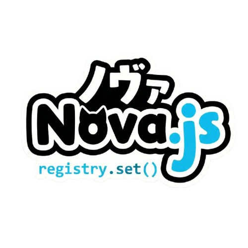

<div align="center">


# 🐺 Nova.js CLI
### *The High-Performance SADA Orchestrator*

[](https://www.npmjs.com/package/nova-cli)
[](LICENSE)
[](https://bun.sh)
[](https://nakikoneko.gitbook.io/seishiroapi)

**Engineered for Absolute Performance. Built for Infinite Scalability.**

[Getting Started](#-quick-start) • [Features](#-key-features) • [Architecture](#-sada-architecture) • [Documentation](https://nakikoneko.gitbook.io/seishiroapi)

</div>

---

<div align="center">
  
</div>

## ✨ Why Nova.js?

Nova.js isn't just another CLI; it's a **dispatcher-first ecosystem** designed to eliminate the "spaghetti routing" of traditional backends. By implementing the **Strict-Action Dispatcher Architecture (SADA)** via Seishiro API, your code remains modular, predictable, and insanely fast.

## 🚀 Key Features

- **⚡ Sat-Set Performance**: Native **Bun.serve** integration. If you run it on Bun, it flies.
- **🧩 Pure SADA**: Decoupled Registry, Controllers, and Policies. Scale without friction.
- **🤖 Future-Proof**: Built-in **AI Agents** & **MCP Server** (Model Context Protocol) templates.
- **💻 Pro Dashboard**: A built-in management panel in **React** or **Vue**. Zero setup required.
- **🔒 Enterprise Security**: Centralized **PolicyBuilder** for versioning and secret passkeys.
- **🐳 DevOps on Autopilot**: One-command **Docker** & **Docker Compose** generation.
- **🛠️ Batteries Included**: 
  - **S3 Storage** (AWS/DO/MinIO)
  - **Redis/Valkey** Cache
  - **Drizzle/Prisma/Mongo** Ready
  - **Paperlog** Structured Logging

---

## 🏗️ SADA Architecture

Nova.js follows the **SADA** (Strict-Action Dispatcher Architecture) pattern:

1. **Registry**: The Map. Connects Action Types to Logic.
2. **Controller**: The Brain. Pure business logic functions.
3. **Policy**: The Guard. Handles security, versioning, and rules.
4. **Message**: The Voice. Standardized, multi-language responses.
5. **Dispatcher**: The Engine. Orchestrates everything into a unified API entry point.

---

## 🛠️ Installation

Get the wolf running on your machine:

```bash
# Global installation
npm install -g nova-cli

# Or via Bun (Recommended)
bun add -g nova-cli
```

## 📖 Quick Start

### 1. Create your world
```bash
nova create my-galaxy
```

### 2. Enter the atmosphere
```bash
cd my-galaxy
```

### 3. Ignite the engines
```bash
nova dev
```

### 4. Enter the Command Center
Navigate to `http://localhost:3000/dashboard` and use your `SEISHIRO_PASSKEY` from `.env`.

---

## 🐺 The Local Orchestrator

Every project comes with its own local `nova` manager. Use it to stay in control:

- `nova dev` — Hot-reload development server.
- `nova dashboard` — Show dashboard access info.
- `nova build` — Compile artifacts for production.
- `nova up` — Spin up Docker containers (App + DB).
- `nova info` — View project metadata and configuration.

---

## 📂 Project Structure

- `src/registry/`: Action mappings.
- `src/controllers/`: Business logic.
- `src/agents/`: AI Agent controllers.
- `src/mcp/`: MCP Server tools.
- `src/utils/`: S3, Cache, Logger, Error Handler.
- `database/`: Models, migrations, and seeds.
- `web/`: Frontend source (React/Vue).
- `public/`: Static assets & build files.

---

<div align="center">

### Built with 💙 for the next generation of developers.
**Join the pack. Build the future.**

[Website](https://novajs.org) • [Documentation](https://nakikoneko.gitbook.io/seishiroapi) • [GitHub](https://github.com/untrustnova/novajs)

</div>
